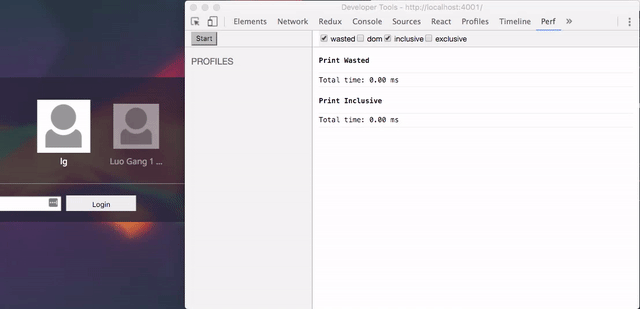

Chrome React Perf



## Features
- Automatically show result when stop
- Stop recording when Perf tab is closed

## Link to chrome store
https://chrome.google.com/webstore/detail/react-perf/hacmcodfllhbnekmghgdlplbdnahmhmm

## How to get it work
- Install the extension from Chrome Store
- Expose Perf (make sure Perf.start() can run from console)

### Expose Perf
Chrome React Perf rely on a global variable called Perf. There are several ways to do that.
- use webpack's expose loader<br/>

  ```javascript
  import 'expose?Perf!react-addons-perf'
  ```

  or

  ```javascript
  loaders: [
    {
      test: require.resolve("react-addons-perf"),
      loader: "expose?Perf"
    }
  ],
  ```

- assign it to window

  ```javascript
  import Perf from 'react-addons-perf'
  window.Perf = Perf
  ```

- If something goes wrong, [open an issue](https://github.com/crysislinux/chrome-react-perf/issues) or tweet me: [@crysislinux](https://twitter.com/crysislinux).

## Install dependencies
> npm install

## Start with Hot Reloading

> npm run dev

## Build production version

> npm run build

## FAQ

## Roadmap
- [x] Start && Stop && Print
- [x] Get a better logo (Thanks to [rubencodes](https://github.com/rubencodes))
- [ ] Support multiple profiles
- [ ] Save settings to localStorage
